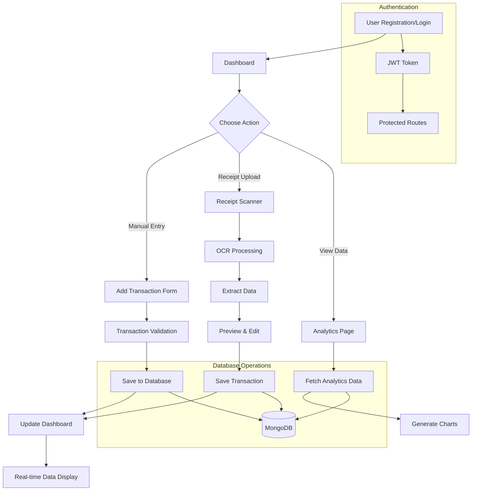

# A comprehensive full-stack web application for managing personal finances with intelligent receipt scanning, transaction tracking, and detailed analytics.

## 🎥 Demo

**Live Demo:** [Add your hosted application link here]rsonal Finance Assistant
**Demo Video:** [Add your demo video link here]

A comprehensive full-stack web application for managing personal finances with intelligent receipt scanning, transaction tracking, and detailed analytics.

## 🌟 Key Features

### 📊 Financial Management
- **Transaction Tracking**: Add, edit, and delete income/expense transactions
- **Smart Categorization**: Organize transactions by categories (Food, Transportation, Bills, etc.)
- **Date Validation**: Prevents future date entries and invalid date formats
- **Source Tracking**: Distinguish between manual, receipt, and imported transactions

### 🧾 Receipt Processing
- **OCR Technology**: Extract transaction data from receipt images using Tesseract.js
- **Multi-format Support**: Process both image files (JPG, PNG) and PDF receipts
- **Auto-categorization**: Intelligent category suggestion based on receipt content
- **Preview & Edit**: Review extracted data before saving to transactions

### 📈 Analytics & Insights
- **Interactive Charts**: Visualize spending patterns with Chart.js
- **Period Analysis**: Monthly, yearly, and custom date range analytics
- **Category Breakdown**: Expense distribution by categories
- **Income vs Expense**: Track financial health over time
- **Trend Analysis**: Monthly spending and income trends

### 🔐 Security & Authentication
- **JWT Authentication**: Secure user sessions
- **Password Hashing**: BCrypt for secure password storage
- **Route Protection**: Authenticated routes for user data
- **Input Validation**: Comprehensive data sanitization

## 🚀 Tech Stack

### Frontend
- **React 19.1.1** - Modern UI library
- **Vite 7.1.2** - Fast build tool
- **React Router DOM 7.9.1** - Client-side routing
- **Chart.js 4.5.0** - Interactive charts
- **Axios 1.12.1** - HTTP client
- **CSS3** - Custom styling with responsive design

### Backend
- **Node.js** - Runtime environment
- **Express.js 5.1.0** - Web framework
- **MongoDB** - NoSQL database
- **Mongoose 8.18.1** - ODM for MongoDB

### Image Processing & OCR
- **Tesseract.js 6.0.1** - OCR engine
- **Sharp 0.34.3** - Image processing
- **Multer 2.0.2** - File upload handling
- **PDF-Parse 1.1.1** - PDF text extraction

### Security & Validation
- **BCrypt.js 3.0.2** - Password hashing
- **JSON Web Token 9.0.2** - Authentication
- **Express Validator 7.2.1** - Input validation
- **Sanitize HTML 2.17.0** - Data sanitization
- **CORS 2.8.5** - Cross-origin resource sharing

## 🔄 Application Workflow



## 📁 Project Structure

```
Personal-Finance-Assistant/
├── Backend/
│   ├── Controllers/         # Business logic
│   ├── Models/             # Database schemas
│   ├── Routes/             # API endpoints
│   ├── Middlewares/        # Authentication & validation
│   ├── Repository/         # Database operations
│   ├── Utils/              # Helper functions
│   ├── Configs/           # Database configuration
│   └── server.js          # Entry point
├── Frontend/
│   ├── src/
│   │   ├── Components/    # Reusable UI components
│   │   ├── Pages/         # Main application pages
│   │   ├── Services/      # API communication
│   │   ├── Context/       # React context
│   │   ├── Utils/         # Helper utilities
│   │   └── styles/        # CSS styling
│   ├── public/           # Static assets
│   └── index.html        # Main HTML file
└── README.md
```

## 🛠️ Installation & Setup

### Prerequisites
- Node.js (v16 or higher)
- MongoDB (local or cloud instance)
- Git

### 1. Clone Repository
```bash
git clone https://github.com/abhi-170/Personal-Finance-Assistant.git
cd Personal-Finance-Assistant
```

### 2. Backend Setup
```bash
cd Backend

# Install dependencies
npm install

# Create environment file
cp .env.example .env

# Configure environment variables
# Edit .env file with your database and JWT settings
```

**Environment Variables (.env):**
```env
PORT=8080
MONGODB_URI=mongodb://localhost:27017/finance-assistant
JWT_SECRET=your-super-secret-jwt-key
NODE_ENV=development
```

### 3. Frontend Setup
```bash
cd ../Frontend

# Install dependencies
npm install

# Create environment file
cp .env.example .env.local
```

**Frontend Environment Variables (.env.local):**
```env
VITE_API_URL=http://localhost:8080/api
```

### 4. Database Setup
- Ensure MongoDB is running on your system
- The application will automatically create the database and collections

## 🚀 Running the Application

### Development Mode

**Start Backend Server:**
```bash
cd Backend
npm run dev
# Server runs on http://localhost:8080
```

**Start Frontend Development Server:**
```bash
cd Frontend
npm run dev
# Frontend runs on http://localhost:5173
```

### Production Mode

**Backend:**
```bash
cd Backend
npm start
```

**Frontend:**
```bash
cd Frontend
npm run build
npm run preview
```

## 📱 Features Walkthrough

### 1. User Authentication
- **Register**: Create new account with email/password
- **Login**: Secure authentication with JWT tokens
- **Protected Routes**: Access control for authenticated users

### 2. Dashboard
- **Overview**: Recent transactions and quick stats
- **Quick Actions**: Add transaction or upload receipt
- **Navigation**: Access to all major features

### 3. Transaction Management
- **Add Transactions**: Manual entry with validation
- **Edit/Delete**: Modify existing transactions
- **Filtering**: Search by description, category, date range
- **Pagination**: Efficient data loading

### 4. Receipt Scanner
- **Upload**: Drag & drop or click to upload
- **Processing**: OCR extracts transaction details
- **Review**: Edit extracted data before saving
- **History**: View recent receipt-processed transactions

### 5. Analytics
- **Charts**: Interactive visualizations
- **Filters**: Period-based analysis
- **Categories**: Spending breakdown
- **Trends**: Income/expense patterns

## 🚀 Deployment

### Backend Deployment (Node.js hosting)
1. Choose a hosting platform (Heroku, Railway, Render)
2. Set environment variables
3. Deploy from GitHub repository

### Frontend Deployment (Static hosting)
1. Build the project: `npm run build`
2. Deploy to Netlify, Vercel, or similar platform
3. Configure environment variables for production API

### Database Hosting
- Use MongoDB Atlas for cloud database
- Update MONGODB_URI in environment variables


## 👥 Author

**Abhinav** - [abhi-170](https://github.com/abhi-170)
